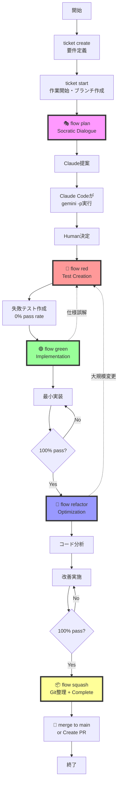

# AIT³ Workflow Documentation

## 📋 Overview

AIT³ (AI + Ticket + Test + Tool driven development) は、Claude Code、Gemini、人間の開発者による知的協働を通じて、ソフトウェア開発を革新するワークフローです。

## 🔄 Core Workflow Diagram



## 📐 標準実装フロー

### 最終確定フロー
```
create → start → plan → red → green → refactor → squash(+complete) → merge
```

### CLIファイル操作とバックエンド対応
| コマンド | Local Backend | GitHub Backend | Git操作 |
|---------|---------------|----------------|---------|
| `ticket create` | `.tickets/todo/`に作成 | GitHub Issueを作成 | - |
| `ticket start` | `todo→doing`に移動 | Issue状態更新 | featureブランチ作成 |
| `ticket complete` | `doing→done`に移動 | Issue Close | - |
| `flow squash` | 自動complete（必要時） | 自動close（必要時） | コミット整理の手順提示 |

### ID フォーマット対応
| バックエンド | IDフォーマット | 例 | 表示される場所 |
|-------------|----------------|----|--------------| 
| **Local** | 4桁ゼロパディング | `0001`, `0042` | `.tickets/doing/0001-feature.md` |
| **GitHub** | GitHub Issue番号 | `#70`, `70`, `1` | `https://github.com/owner/repo/issues/70` |

**統一対応**: 全てのticket・flowコマンドでLocal・GitHub両方のIDフォーマットを受け付け

### 完全なワークフロー手順

```bash
# 1. チケット作成（Local・GitHub対応）
ait3 ticket create "User authentication system"
# Local: .tickets/todo/0001-user-authentication.md 作成
# GitHub: GitHub Issue #123 作成

# 2. 作業開始（統一IDフォーマット対応）
ait3 ticket start 001      # Local ID
ait3 ticket start 123      # GitHub Issue番号  
ait3 ticket start #123     # GitHub Issue番号（#付き）
# → feature/001-user-authentication ブランチ作成
# → チケットを doing に移動 / Issue状態更新

# 3. PLANNING Phase - Socratic Dialogue（ID統一対応）
ait3 flow plan "user-authentication" --ticket 001
# → Claude Codeに /ait3 plan を実行させる
# → チケット場所: Local=ファイルパス、GitHub=Issue URL表示
# → Gemini分析の結果を確認
# → 人間が最終決定

# 4-7. 以降のflowコマンドも同様にID統一対応
ait3 flow red 001     # Local ID
ait3 flow red 123     # GitHub ID
ait3 flow red #123    # GitHub ID（#付き）
```

## 🎭 Phase Details with Role Assignments

### Phase 0: Ticket Creation
**目的**: 要件の明確化とチケット作成

| Actor | 責任 | 実行内容 |
|-------|------|---------|
| **人間** | 要件定義 | 機能要件、受け入れ条件の記述 |
| **CLI** | チケット作成 | `.tickets/todo/`にファイル作成 |
| **Claude Code** | - | - |
| **Gemini** | - | - |

### Phase 1: Ticket Start
**目的**: 作業開始の宣言とブランチ準備

| Actor | 責任 | 実行内容 |
|-------|------|---------|
| **人間** | 作業開始判断 | 優先順位の確認 |
| **CLI** | 環境準備 | ブランチ作成、チケット移動（`todo→doing`） |
| **Claude Code** | - | - |
| **Gemini** | - | - |

**推奨実装**: 
```bash
# startコマンドでブランチ自動作成
git checkout -b feature/001-{ticket-slug}
```

### Phase 2: PLANNING (Socratic Dialogue)
**目的**: 実装前に弁証法的推論を通じてアプローチを検証

| Actor | 責任 | 実行内容 |
|-------|------|---------|
| **人間** | 最終決定、Gemini分析指示 | アプローチの評価と選択 |
| **CLI** | 提案テンプレート表示 | プロジェクト分析、構造化された出力 |
| **Claude Code** | アプローチ提案、Gemini実行 | `/ait3 plan`参照、`gemini -p`コマンド実行 |
| **Gemini** | 批判的分析 | Claude提案への反論、代替案提示 |

**Note**: PLAN承認後、RED〜SQUASHまでは人間の介入任意

### Phase 3: RED (Test Creation)
**目的**: 実装詳細ではなく、チケット要件を反映する包括的なテストを作成

| Actor | 責任 | 実行内容 |
|-------|------|---------|
| **人間** | テスト内容確認・調整 | 受け入れ条件の妥当性確認 |
| **CLI** | テストパス提示 | テストファイルパスと基本構造の提供 |
| **Claude Code** | テストコード生成 | `/ait3 red`参照、具体的なテストケース作成 |
| **Gemini** | - | 必要に応じてテスト戦略の検証 |

**重要原則**:
- テストは要件を反映（実装詳細に依存しない）
- 0% pass rateが初期状態（すべて赤）
- エッジケースとエラー条件を網羅

### Phase 4: GREEN (Implementation)
**目的**: 100%テスト合格率を達成する最小限のコードを実装

| Actor | 責任 | 実行内容 |
|-------|------|---------|
| **人間** | 実装方針承認、進捗確認 | アプローチの妥当性判断 |
| **CLI** | テスト実行、進捗表示 | `npm test`実行、リアルタイム進捗 |
| **Claude Code** | 最小実装 | `/ait3 green`参照、テスト通過コード作成 |
| **Gemini** | - | - |

**テスト変更ポリシー**:
- 原則: テスト変更禁止（strictモード）
- 例外: 明らかな仕様誤解 → REDフェーズに戻る

### Phase 5: REFACTOR (Optimization)
**目的**: 100%テストカバレッジを維持しながらコード品質を改善

| Actor | 責任 | 実行内容 |
|-------|------|---------|
| **人間** | 改善箇所選択 | リファクタリング範囲の決定 |
| **CLI** | コード分析 | linter実行、型チェック、重複検出 |
| **Claude Code** | リファクタリング実施 | `/ait3 refactor`参照、最適化実行 |
| **Gemini** | 品質評価 | 必要に応じてコード品質の検証 |

### Phase 6: SQUASH (Git Commands)
**目的**: クリーンなコミット履歴の作成準備

| Actor | 責任 | 実行内容 |
|-------|------|---------|
| **人間** | 実行判断、PR/merge決定 | 最終確認とGitコマンド実行 |
| **CLI** | コマンド提示、自動complete | Git整理手順の提示、必要時に自動ticket complete |
| **Claude Code** | コミットメッセージ作成 | 変更内容の要約と説明 |
| **Gemini** | - | - |

**Note**: `flow squash`はチケットがdone状態でない場合、自動的にticket completeを実行

## 📋 各フェーズの詳細な提示内容

### 📝 CREATE Phase 提示内容
```
✅ Ticket #001 created successfully

📍 Location: 
  • Local Backend: .tickets/todo/001-{ticket-slug}.md
  • GitHub Backend: https://github.com/owner/repo/issues/123

🚀 Next Steps:
1. Start working on the ticket:
   $ ait3 ticket start 001    # Local ID
   $ ait3 ticket start 123    # GitHub ID  
   $ ait3 ticket start #123   # GitHub ID（#付き）
   
   This will:
   - Move ticket to 'doing' status / Update Issue state
   - Create feature branch (future feature)

💡 Note: All commands accept both Local (0001) and GitHub (#123, 123) ID formats
```

### 🏃 START Phase 提示内容
```
✅ Started ticket #001: {ticket.title}

📊 Details:
   Status: doing
   Location: 
     • Local: .tickets/doing/001-{ticket-slug}.md
     • GitHub: https://github.com/owner/repo/issues/123

Next Action:
└─ Run: ait3 flow plan 001 (IDフォーマット統一対応済み)
```

### 🎭 PLAN Phase 提示内容
```
🎭 PLANNING Phase for Ticket #001: {ticket.title}
📍 Ticket location: 
  • Local: .tickets/doing/001-{ticket-slug}.md
  • GitHub: https://github.com/owner/repo/issues/123

Next Action:
├─ Analyze project context:
│  ├─ Read CLAUDE.md for project conventions
│  ├─ Read ticket (Local: file, GitHub: Issue URL)
│  └─ Analyze relevant source files
├─ Design implementation approach
├─ Consult Gemini for critical analysis:
│  └─ Local: gemini -p "@src/ @CLAUDE.md @.tickets/doing/001-*.md Critique this approach"
│  └─ GitHub: gemini -p "@src/ @CLAUDE.md Critique approach for Issue #123"
├─ Update ticket with your plan:
│  └─ Local: Add "## Design" section / GitHub: Update Issue description
├─ Commit plan: git add . && git commit -m "planning(#001): design approach"
└─ Run: ait3 flow red 001 (IDフォーマット統一対応)
```

### 🔴 RED Phase 提示内容
```
🔴 RED Phase for Ticket #001: {ticket.title}
📍 Ticket location: .tickets/doing/001-{ticket-slug}.md

Next Action:
├─ Create comprehensive test cases:
│  ├─ Test main functionality requirements
│  ├─ Test error scenarios and edge cases
│  ├─ Test integration points
│  └─ Ensure 0% pass rate initially
├─ Verify tests align with ticket requirements
├─ Commit: git add . && git commit -m "test(#001): create failing tests"
└─ Run: ait3 flow green 001
```

### 🟢 GREEN Phase 提示内容
```
🟢 GREEN Phase for Ticket #001: {ticket.title}
📍 Ticket location: .tickets/doing/001-{ticket-slug}.md

Next Action:
├─ Implement minimal code to pass tests:
│  ├─ Follow existing codebase patterns
│  ├─ Use pure functions + service injection
│  ├─ Keep implementation minimal
│  └─ Create tickets for mock implementations
├─ Run tests until 100% pass rate
├─ Commit: git add . && git commit -m "feat(#001): implement feature"
└─ Run: ait3 flow refactor 001
```

### 🔧 REFACTOR Phase 提示内容
```
🔧 REFACTOR Phase for Ticket #001: {ticket.title}
📍 Ticket location: .tickets/doing/001-{ticket-slug}.md

Next Action:
├─ Run code quality checks:
│  ├─ npm run lint
│  ├─ npm run type-check
│  └─ Check for code duplication
├─ Refactor priorities:
│  ├─ Extract common patterns
│  ├─ Improve error handling consistency
│  ├─ Enhance code readability
│  └─ Optimize performance if needed
├─ Maintain 100% test pass rate
├─ Commit: git add . && git commit -m "refactor(#001): optimize implementation"
└─ Run: ait3 flow squash 001
```

### 📦 SQUASH Phase 提示内容
```
📦 SQUASH Phase for Ticket #{ticket.id}: {ticket.title}
📍 Ticket location: .tickets/done/{ticket.id}-{ticket-slug}.md

✅ Ticket is already completed (or auto-completed if not done)

Related commits to squash:
├─ xxxxxxx planning(#{ticket.id}): design approach
├─ xxxxxxx test(#{ticket.id}): create failing tests
├─ xxxxxxx feat(#{ticket.id}): implement feature
└─ xxxxxxx refactor(#{ticket.id}): optimize implementation

Next Action:
├─ Squash commits:
│  └─ git rebase -i main
├─ Create final commit:
│  └─ git commit -m "feat(#{ticket.id}): {concise summary}"
├─ Push changes:
│  └─ git push --force-with-lease
└─ Create PR or merge to main
   
3. PR/Merge options:
   # Option 1: Create PR
   gh pr create --title "feat(#{ticket.id}): {title}"
   
   # Option 2: Merge to main
   git checkout main
   git merge --ff-only feature/{ticket.id}-{slug}

```

## 🚨 例外パターンと対処法

### 1. テスト仕様の誤解（GREEN → RED）
```bash
# GREENフェーズでテストが実装と合わない場合
ait3 flow green 001 --strict
# → 警告表示
# → 人間の判断でREDフェーズに戻る
ait3 flow red 001 --revise
```

### 2. 大規模リファクタリング（REFACTOR → RED）
```bash
# REFACTORフェーズで構造変更が必要な場合
ait3 flow refactor 001
# → 新規チケット作成を提案
ait3 ticket create "Refactor authentication architecture"
```

### 3. 緊急修正フロー
```bash
# バグ修正など、簡略化フロー
ait3 ticket create "Fix login bug" --type bug
ait3 ticket start 002
ait3 flow red 002 --minimal  # 最小限のテスト
ait3 flow green 002
ait3 flow squash 002 --hotfix
```

### 4. 作業の中断と再開
```bash
# 優先度の高いタスクへの切り替え
git stash save "WIP: ticket 001"
ait3 ticket start 003  # 緊急タスク

# 後で元のタスクに戻る
git checkout feature/001-original
git stash pop
```

### 5. 汎用的なエラーハンドリング
```bash
# テスト実行エラー（GREEN Phase）
Error: Cannot find module 'vitest'
→ 依存関係確認: npm install / pip install / bundle install

# ビルドエラー（各Phase共通）
Type error: Property 'foo' does not exist
→ 型定義確認、インターフェース修正

# AI実行エラー
Claude Code error: Context too large
→ より具体的なファイルパスを指定して再実行

# Gemini実行エラー
gemini: command not found
→ Gemini CLIのインストール確認
```

## 🛠️ カスタムコマンドとOrchestrator統合

### カスタムコマンド構成（単一ファイル）

**`.claude/commands/ait3`** 
```markdown
# AIT³ Workflow Commands

現在のチケット情報とフェーズを認識し、適切なガイダンスを提供します。

## /ait3 status
現在の状態を確認:
- .tickets/doing/の最新チケットを確認
- 現在のGitブランチから作業中のチケットを推定
- 次の推奨アクションを提示

## /ait3 plan
PLANNING Phaseの実行:
1. .tickets/doing/の最新チケット内容を分析
2. プロジェクト構造を調査（@src/, @tests/）
3. 類似実装パターンを検出
4. 具体的な実装アプローチを提案
5. Gemini分析コマンドを生成: gemini -p "@src/ @CLAUDE.md @.tickets/doing/*.md Critique approach"
6. 提案を統合して人間の決定を待つ

## /ait3 red
RED Phaseの実行:
1. チケットの受け入れ条件を抽出
2. プロジェクトのテストフレームワークを検出（vitest/jest等）
3. 既存のテストパターンに準拠したテストコード生成
4. すべてのテストが失敗することを確認（0% pass rate）
5. エッジケースとエラーシナリオを網羅

## /ait3 green
GREEN Phaseの実行:
1. npm test を実行して現在の状況を把握
2. 失敗しているテストを分析
3. 既存のコードパターンに従って最小実装
4. テスト通過まで反復（100% pass rate達成）
5. モック実装は明示的にマークし、新規チケット作成を提案

## /ait3 refactor
REFACTOR Phaseの実行:
1. npm run lint でコード品質チェック
2. npm run prettier でフォーマット
3. npm run type-check で型安全性確認
4. TypeScriptの場合: similarity-ts で重複コード検出
5. 100%テスト通過を維持しながら最適化

## /ait3 squash
SQUASH Phaseの実行:
1. すべてのテストが通過していることを確認
2. チケットを.tickets/done/に移動するコマンドを提示
3. Git履歴を整理するコマンドシーケンスを生成
4. コミットメッセージのテンプレートを作成
5. PR作成またはmainマージのオプションを提示

## /ait3 orchestrate
Orchestratorパターンで全体のフローを管理:
1. 現在のフェーズを特定
2. 次に実行すべきコマンドを提案
3. TodoWriteでタスクを管理
4. フェーズ間の移行を支援
```

### Orchestratorとの連携

**`.claude/commands/orchestrator`の活用**:
- 各フェーズを「Step」として管理
- フェーズ内のタスクは並列実行可能
- フェーズ完了後に次のステップを再評価
- 中断・再開のコンテキスト管理

## 📊 実装メトリクスと品質基準

### 必須基準
- **テスト合格率**: GREEN/REFACTORフェーズで100%維持
- **コードカバレッジ**: 90%以上（クリティカルパスは100%）
- **型安全性**: TypeScript strict mode、any禁止
- **コミット規約**: conventional commits形式

### 推奨基準
- **コード重複**: similarity-tsで5%未満
- **循環的複雑度**: 関数あたり10以下
- **コミット粒度**: 1フェーズ1コミット
- **PR/mergeタイミング**: squash完了後即座に

## 🚀 実装ロードマップ

### Phase 1: 基本改善（✅完了）
- [x] 各flowコマンドの動的コンテンツ生成
- [x] ticket startにブランチ作成機能追加
- [x] squashにticket complete統合
- [x] **GitHub Issues統合とIDフォーマット統一対応**
- [x] **全コマンド（ticket・flow）でLocal/GitHub ID対応**
- [x] **チケット場所情報統一（ファイルパス/GitHub URL）**
- [ ] テスト実行結果のリアルタイム表示

### Phase 2: カスタムコマンド統合
- [x] `.claude/commands/ait3`作成と自動インストール
- [x] 各フェーズでの自動参照指示の実装
- [x] チケット情報との連携強化

### Phase 3: 高度な統合（進行中）
- [ ] GitHub連携の詳細機能追加（ラベル同期等）
- [ ] フェーズ間のコンテキスト保存・復元
- [ ] 中断・再開メカニズム
- [ ] メトリクス収集と可視化

### Phase 4: 完全自動化
- [ ] Orchestratorパターンの完全実装
- [ ] AIによる自動フェーズ遷移提案
- [ ] 統合ダッシュボード

## 📝 Gemini分析による改善提案と反駁

### 1. フローの柔軟性
**指摘**: 理想的だが剛直すぎる。小規模タスクには過剰な可能性
- **対応案**: `--type=trivial`で軽量フロー許可（例: plan省略）
- **反駁**: PLANフェーズは思考の場であり省略不可。Gemini相談を任意にすることで対応
- **決定**: `--type=trivial`は実装しない。PLANフェーズ内でGemini分析を任意とする

### 2. ticket completeのタイミング
**指摘**: PRレビューで却下された場合の運用が不明確
- **明確化**: squashは「マージ準備完了」、実際のmerge後が「完了」
- **反駁**: 差し戻しコマンド実装により、PR却下時も適切に対応可能
- **決定**: `ticket reopen`コマンドで`done→doing`への移動を可能にする

### 3. AIの限界への対処
**指摘**: AIが期待通り動作しない場合のフォールバック不明
- **対処**: 各フェーズでAI失敗時の手動実行手順を併記
- **反駁**: 各コマンドでチケット読み込みを明示的に指示することで対応
- **決定**: Claude Codeへの指示に「チケットを読んで」を必須とする

### 4. 自動化モードの提案
**指摘**: `--auto`でplan→refactorまで自動実行
- **反駁**: 人間の最終決定権はAIT³の核心原則であり、これを侵害する機能は実装しない
- **決定**: `--auto`モードは実装しない

### 4. 追加すべき例外パターン
- **依存関係の更新**: `npm install`必要時の自動検知
- **外部API変更**: コード外要因でのテスト失敗
- **複数人作業**: コンフリクト解決ガイドライン

### 5. ブランチ作成の改善
**指摘**: 命名規則の固定化リスク
- **対応**: チケットタイプに応じた柔軟なプレフィックス
  - bug → `bugfix/`
  - hotfix → `hotfix/`
  - feature → `feature/`
- **衝突回避**: 既存ブランチ名との重複時はサフィックス付与

### 6. チーム開発への拡張
**現状**: シングルユーザー想定
- **将来**: リモートリポジトリ連携、複数人での状態共有

## 🚨 フローの軸を守るための注意事項

### 絶対に譲れない原則
1. **Socratic Dialogue**: PLANフェーズでの弁証法的検証は必須
2. **TDD原則**: RED→GREEN→REFACTORの順序は不可侵
3. **人間の最終決定権**: 自動化してもクリティカルな判断は人間

### 柔軟に対応可能な部分
1. **軽量タスク**: PLANフェーズの簡略化（ただしスキップは禁止）
2. **ブランチ命名**: プロジェクトに応じたカスタマイズ
3. **例外処理**: 状況に応じた戻りや中断

## 🎯 成功の鍵

1. **明確な役割分担**: 各アクターの責任範囲を厳守
2. **フロー順序の遵守**: create → start → plan → red → green → refactor → squash → merge
3. **フィードバックループ**: 各フェーズで振り返りと改善
4. **ドキュメント駆動**: カスタムコマンドで知識を蓄積
5. **人間の最終決定権**: AIは提案と実行、人間が判断
6. **原則と柔軟性のバランス**: コアは守りつつ現実に適応